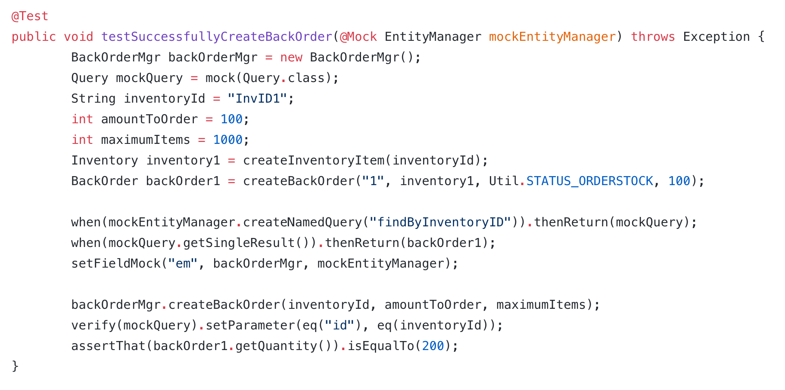
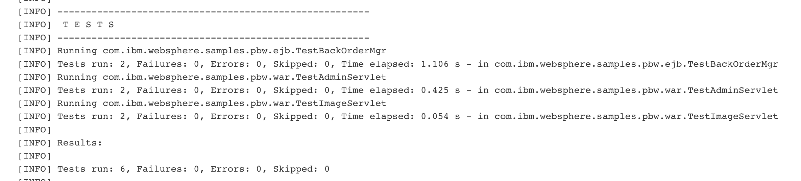

# Introduction to testing
In this lab, we will take a quick look at two different kinds of testing commonly done in software projects: static code analysis and unit testing.

Unit testing is the phase in CI where individual components (or "units") are tested. These components are typically the smallest parts of your project that do only one thing.

Static Code Analysis is the phase in CI where the code is checked for stylistic errors, problems with code structure, and overall code quality. One common form of static code analysis is called "linting".

The goal of this lab is not to teach you how to write tests, but rather where they fit in the deployment pipeline.

## Setup
This lab continues off of the previous lab, [Deploying a JavaEE app to IBM Kubernetes Service with Jenkins](https://github.com/odrodrig/app-modernization-cicd-lab-iks).

Be sure you have completed the previous lab and have a deployed application.

## Tools
JUnit - Unit testing framework for java applications

Mockito - Mocking framework for simulating objects during unit tests

PMD - Tool for static code analysis on java apps

Maven - A tool for building, testing, and managing java applications. Has an extensive list of plugins available. 

## Taking a look at the Unit tests
This application that we deployed contains 6 different unit tests contained within 3 different files. In this section we will take a quick look at one of those tests before we implement it in our pipeline. 

1. Take a look at the unit test located in this file [TestBackOrderMgr.java](https://github.com/odrodrig/app-modernization-plants-by-websphere-jee6/blob/master/pbw-web/src/test/com/ibm/websphere/samples/pbw/ejb/TestBackOrderMgr.java).

This is one of the unit tests included in the project that you have been working on.

2. This file contains 2 tests for 2 different cases: Successfully creating a back order, and getting a null result in a query.

On line 29, this test case is to test a request that should create a successful back order for our store. 



These units being tested might depend on other complex objects to function, however to make things easier and more efficient, these tests are using a concept known as "mocking" to simulate those complex dependencies.

The last line in the tests is the assert statement. This is a statement that must evaluate to true in order for these tests to pass.

Now that we have seen what a unit test looks like, let's move on to implementing these tests.

## Testing in the Pipeline
In our pipeline we are utilizing Maven to create our deployable .ear file which contains our application and all of it's dependencies. We can also utilize Maven to run our unit tests and static code analysis.

Maven has it's own build lifecycles composed of different phases. The three lifcycles available are default, clean, and site. For our purposes, we will be using the ```clean``` lifecycle which cleans our project up by removing artifacts from previous builds.


According to the [Maven documentation](https://maven.apache.org/guides/introduction/introduction-to-the-lifecycle.html), these phases include:

validate - validate the project is correct and all necessary information is available

compile - compile the source code of the project

test - test the compiled source code using a suitable unit testing framework. These tests should not require the code be packaged or deployed

package - take the compiled code and package it in its distributable format, such as a JAR.

verify - run any checks on results of integration tests to ensure quality criteria are met

install - install the package into the local repository, for use as a dependency in other projects locally

deploy - done in the build environment, copies the final package to the remote repository for sharing with other developers and projects.


When you want to build your application using maven, you need to specify a lifecycle and a phase. For example, in our current pipeline, we are running ```mvn clean package``` which will run each phase of the build lifecycle above up until the end of ```package```. So this means that Maven will validate, compile, test, and package the application when we run our pipeline.

In the previous lab we also included the flag, ```-DskipTests``` which skips over the test phase in the lifecycle. Now that we have touched upon testing, let's go ahead and remove that flag from our build stage.

1. Navigate to your app-modernization-plants-by-websphere-jee6 project in GitHub.
2. Find and click on the **Jenkinsfile.iks** file


3. Then, click on the pencil icon on the right side of the page to edit the file.


4. Look for line 71 and change that line to the following:
```
mvn clean verify -B -Dorg.slf4j.simpleLogger.log.org.apache.maven.cli.transfer.Slf4jMavenTransferListener=warn
```
In this new build command we are choosing the ```verify``` phase which will package our app as before but this time it will then run some static code analysis on our code to catch common coding mistakes. The string that comes after is just to keep our log clean.

5. Scroll down, enter a commit message, and click **Commit Changes**


6. Then go back to your Jenkins and navigate to the pipeline that you created in the previous lab.

7. Notice how the latest automated build failed. Click on the colored circle next the latest entry under **Build History** to go to the console log of your latest automated build.


8. Scroll down until you get to **BUILD FAILURE** 


The build failed because PMD found many coding mistakes. PMD is a tool that checks for common Java mistakes such as unused variables and unnecessary parenthesis. Most of the errors that are showing up in our logs are small mistakes that can be ignored. Let's add the option to ignore these errors.

9. Go back to your project in GitHub and navigate to the top level of the repo if you aren't there already.

10. Then, navigate to the **pbw-web** directory and click on **pom.xml**

11. Click on the pencil icon on the right side of the page to edit the file.

12. Scroll down to line 100 and change the ```true``` to ```false```

This change will ensure that the build continues even when PMD identifies code issues.

For our pipeline, we are choosing to continue building even after PMD finds errors since these errors are so inconsequential. However, you can specify your own rules for what you want PMD to catch and fail the build when those specific code errors are found.


13. Add a commit message and commit the changes

14. Next, go back to Jenkins and navigate to your pipeline.

15. Click on the circle next to the latest build in the **Build History** section to go to the console log.

16. Scroll down the logs until you see the ```TESTS``` section



Here you can see the results of the unit tests. All 6 tests have passed.

17. Scroll down farther in the log and look for the lines that begin with ```PMD Failure .....``` as seen below.


This time however, the build passed since we chose to ignore those failures. With the unit tests passed and with PMD errors given the OK, the app will continue to deploy like normal.

## Conclusion
In this lab we took a quick look at unit testing and static code analysis as a quality check. We then implemented these tests in our pipeline in Jenkins. We saw our quality gate in action as the build failed due to errors found during static code analysis. After deciding to ignore those errors we ran the pipeline again and saw the unit tests passing and the app deploying to Kubernetes.