# DevOps 101 - Introduction to Git
In this lab we will be taking a look at git source control management as well as how we can use GitHub to store our projects.

## Prerequisites
- A GitHub account

## Configuring your git cli
1. Open up your web terminal instance by navigating to the address given to you. It should look like *http://oliver-workshop-terminals.us-east.containers.appdomain.cloud/termXX*.

2. Navigate to the *data* directory by using the following command
```
cd data/
```

This directory that we just changed into has the permissions that we need to run the commands for our labs today. Be sure that all of the work that you are doing resides within this directory.

3. Now we need to configure our Git cli to authenticate with our GitHub account. In the terminal, enter the following command replacing *your_username* with your GitHub username.
```
git config --global credential.https://github.com.username your_username
```

4. Then run the following command to have your username added to commit messages going forward. Replace *your_username* to your own GitHub username:
```
git config --global user.name "your_username"
```

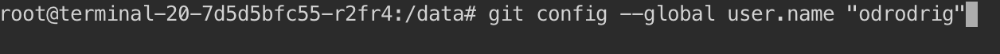


5. Then, enter the following command replacing *your_email* with your GitHub email address.
```
git config --global user.email your_email
```

## Getting your own copy of the code
For this lab we will be utilizing a project that already exists and making our own copy of it. We will do this through a process call *forking* and then *cloning*.

### Forking the repository
1. In your browser, navigate to https://github.com/odrodrig/app-modernization-plants-by-websphere-jee6.
2. From here, we now want to create our own copy of this repo. Click on the **Fork** button near the upper right side of the page.

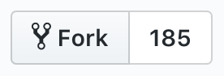

3. When done, you will be taken to your own copy of the repo. Next, we need to clone the repo to have a local copy. 

### Cloning a repo locally
Click on the green button on the right side of the repo that says *Clone or donwload* and copy the URL that appears.

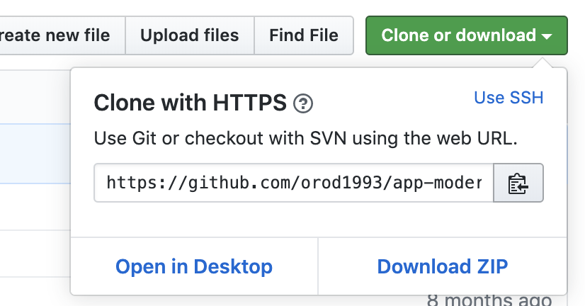

4. Then, switch back to your web terminal. Enter the following command and ensure that your are in the **/data** directory:
```
pwd
```

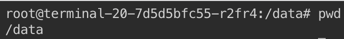

5. Now let's clone the project. Enter the following command replacing *repo_url* with the url that your copied earlier.
```
git clone repo_url
```

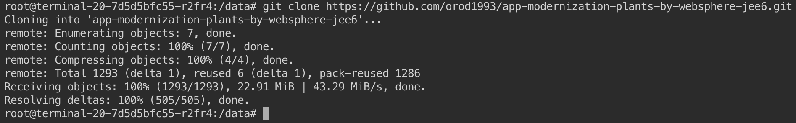

Now that we have a local copy, we can develop on the app, make changes, and do whatever we need.

## Committing changes
In this section we will add a new file to our app, commit the changes, and push them out to GitHub. To do this, we will utilize the *git add*, *git commit*, and *git push* commands.

1. From our web terminal, change directories into the repo we just cloned by using the following command:
```
cd app-modernization-plants-by-websphere-jee6/
```

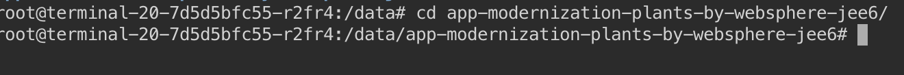

2. Now let's add a text file that we want to include in our repo. Enter the following command to create the empty file "test.txt".
```
touch test.txt
```

3. Next we need to stage our changes for our commit. Run the following command to stage all modified files in your working directory.
```
git add .
```

4. Then, we can commit our change. Remember that commit messages should be concise and descriptive. Run the following command to commit your change:
```
git commit -m "Added test.txt file"
```

5. Next push to GitHub by running the following command:
```
git push
```

6. Enter your GitHub password when asked.

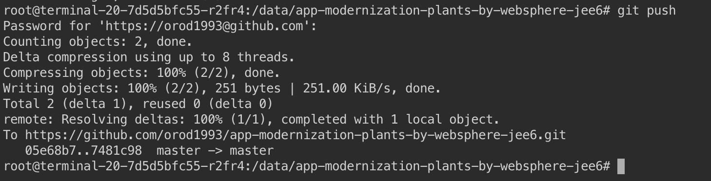

Your change has now been pushed to your remote repository on GitHub. In the next section, we will explore how we pull changes from the remote.

## Pulling changes locally
When working on a project in GitHub, it is pretty common to collaborate with other developers on the same repo. When one person pushes and merges changes into the repo, it is important for other collaborators to pull the new changes to their local repositories to get the latest additions. To simulate other developers making changes, we will be using the code editor on GitHub to make a change to our file and then pull the changes to our local repository.

1. In your browser, go back to your repo on GitHub.
2. Find and click on **test.txt** from your list of files.
3. Then, click on the pencil icon on the right side of the page to edit the file.

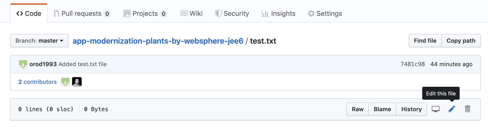

4. You can use this editor to make simple changes to your files directly in GitHub. Let's go ahead and add some text to the file. Add a simple message like the following"
```
This file has been changed. Pull changes locally to get the latest version.
```

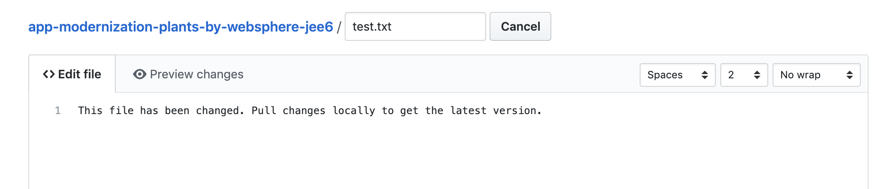

5. Then, enter a descriptive commit message and click on **Commit changes**

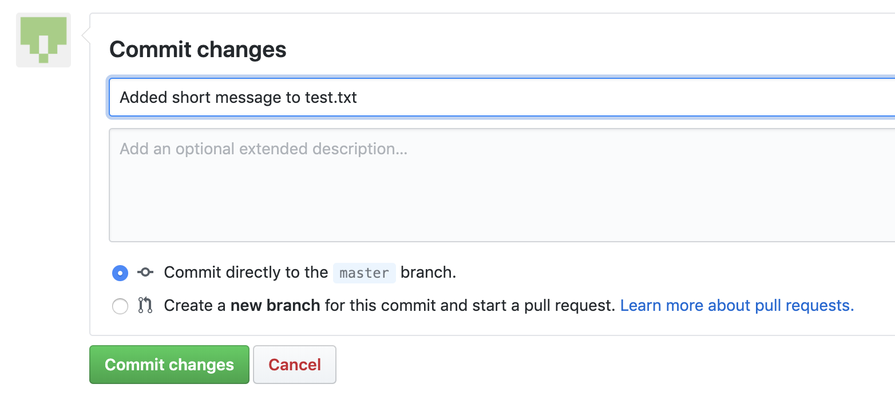

6. Now go back to your web terminal and run the following command
```
cat test.txt
```

Since we haven't pulled changes yet, nothing should show up.

7. To pull the latest changes and merge them into your local repository, run the following command:
```
git pull
```

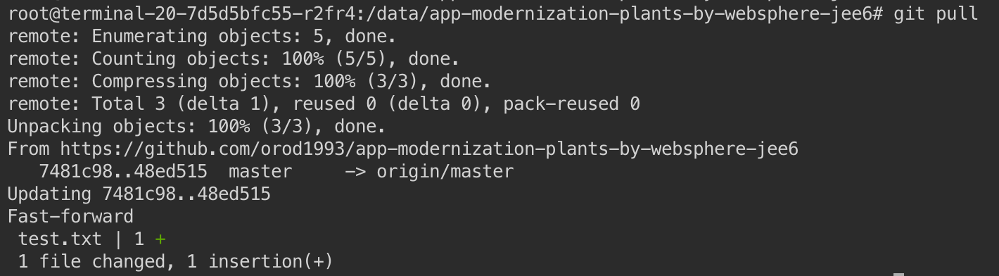

8. Finally, to verify that the changes came through, run the following command to examine the contents of the file.
```
cat test.txt
```

You should see the short message that you added to the file in the GitHub editor is now printed to the terminal.

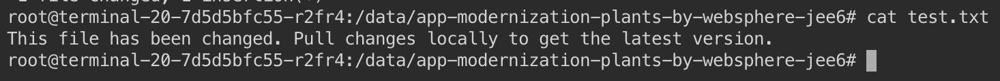

# Conclusion
In this lab we covered forking our own copy of a repo and making a local clone of it. Then we added a new file, staged the change, committed, and then pushed to our remote repo on GitHub. Lastly, we made a change in the GitHub editor and pulled the change to our local repository. 

Continue on to the next lab, working with Helm.
