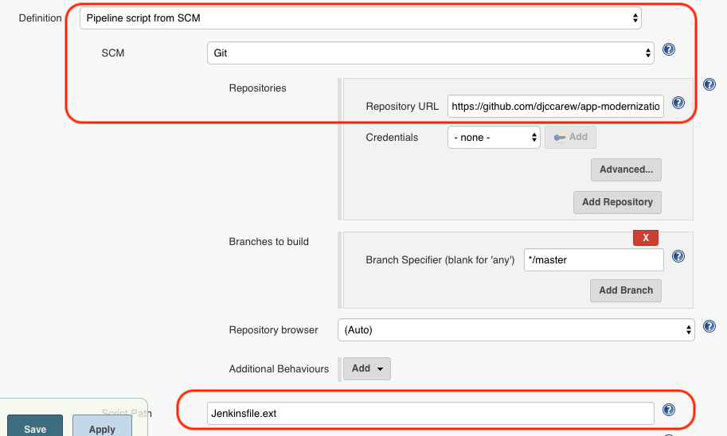
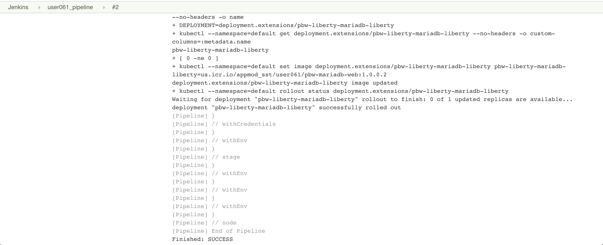
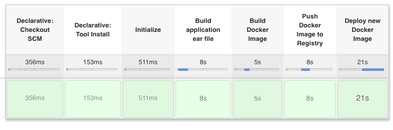
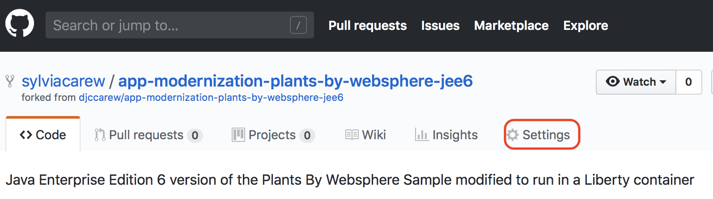

# IBM Client Developer Advocacy App Modernization Series

### Lab - Migrating Legacy JEE apps to IBM Cloud Kubernetes Service

### Part 2 -  Creating a CI/CD Pipeline for deployment to IBM Cloud Kubernetes Service using Jenkins

## Overview

In this lab you will  be connecting your Git repository with the Plants by WebSphere app to a Continuous Integration/Continuous Deployment pipeline built with Jenkins that will deploy to a IBM Cloud Kubernetes Service cluster.

## Setup

If you haven't already:

1. Complete *Part 1 -  Working with Helm*  by following the instructions [here](https://github.com/IBMAppModernization/app-modernization-helm-lab-iks)

2. Initialize Helm client
   ```
   helm init --client-only
   ```

3. Go to the folder where you cloned the Plants By WebSphere  app in the previous lab
   ```
   cd app-modernization-plants-by-websphere-jee6
   ```   

###  Step 1: Set up the CI/CD pipeline

In this section we will be connecting our cloned Git repo of [this app](https://github.com/IBMAppModernization/app-modernization-plants-by-websphere-jee6)  to set up a Continuous Integration/Continuous Deployment pipeline built with Jenkins. This pipeline contains 4main  steps as follows:

  | Stage                         | Purpose                                                                        |
  | ----------------------------- | ------------------------------------------------------------------------------ |
  | Build Application ear File    | Pulls in dependencies from Maven and packages application into .ear file       |
  | Build Docker Image            | Builds the Docker image based on the Dockerfile                                |
  | Push Docker Image to Registry | Uploads the Docker image to the Docker image registry within ICP               |
  | Deploy New Docker Image       | Updates the image tag in the Kubernetes deployment triggering a rolling update |

More details of this pipeline can be found in the [Jenkinsfile](https://raw.githubusercontent.com/IBMAppModernization/app-modernization-plants-by-websphere-jee6/master/Jenkinsfile.ext).

1. Log into Jenkins using the URL provided to you by your instructor with the credentials provided to you

2. The pipeline should have already been created for you.


3. Click on your pipeline to open it and then click on the **Configure** link in the navigation area at the left to change it's properties

4. Scroll down to the **Build Trigger** section and select **GitHub hook trigger for GIT SCM polling**


5. Scroll down to the **Pipeline** section and find the **Definition** drop down menu. Select **Pipeline script from SCM** and for **SCM** select **Git**.

6. For **Repository URL** enter the url to the cloned repository that you forked earlier (i.e. `https://github.com/[your username]/app-modernization-plants-by-websphere-jee6.git`)

7. Change the **Script Path** to `Jenkinsfile.ext`




8. Click **Save**.

### Step 3: Manually trigger a build to test pipeline

1. In Jenkins in the navigation area on the left click on **Build with Parameters**. Accept the defaults of the parameters and click on **Build**

2. To see the console output click on the build number in the **Build History** and then click on **Console Output**


3. If the build is successful the end of the console output should look like the following:



&nbsp;&nbsp;&nbsp;&nbsp;&nbsp;&nbsp;The Stage View of the pipeline should look like the following:


### Step 4: Trigger a build via a commit to Github

Now you'll configure Github to trigger your pipeline whenever code is committed.

1. Go back to Github and find your cloned repository

2. Click on the repository settings



3. Under **Options** select **Webhooks** and click **Add webhook**


4. For the Payload URL use `<Jenkins URL>/github-webhook/`  where `<Jenkins URL>` is the  URL you used  to login to Jenkins (**Note** Don't forget the trailing `/`)

5. Change content type to **application/json**

6. Accept the other defaults and click **Add webhook**


7. In the Github file browser drill down to *pbw-web/src/main/webapp/promo.xhtml*

8. Click on the pencil icon to edit **promo.xhtml**  and on line 95 locate the price of the Bonsai Tree

9. Change  `$30.00 each` to `<strike>$30.00</strike> $25.00 each`

This will show the price of the Bonsai Tree as being reduced even more


10. At the bottom of the UI window add a commit message and click on **Commit changes**

11. Switch back to Jenkins  and open the pipeline that you were working on  earlier.

12. Verify that your pipeline  starts building.

13. When the pipeline is finish deploying, launch the app to verify the change you made.

14.Run the following command to get the port number of your deployed app

   ```
   kubectl --namespace default get service pbw-liberty-mariadb-liberty -o jsonpath='{.spec.ports[0].nodePort}'
   ```

15. Run the following command to get the external IP address  of the first worker node in your cluster

   >If you don't have the $USERNAME environment variable in the command set, replace $USERNAME with your lab user id.

   ```bash
   ibmcloud cs workers $USERNAME-cluster | grep -v '^*' | egrep -v "(ID|OK)" | awk '{print $2;}' | head -n1
   ```

16. Your app's URL is the IP address of the first worker node with the port number of the deployed app. For example if your external IP is 169.61.73.182 and the port is 30961 the URL will be ```http://169.61.73.182:30961```

17. Enter the URL in hr browser's address bar and verify that the price of the Bonsai tree has been reduced.


## Cleanup

Free up resources for subsequent labs by deleting the Plants by Websphere app.

1. Run the following command to delete the app

   ```
   helm delete --purge pbw-liberty-mariadb
   ```


## Summary

You created a Jenkins pipeline to automatically build and deploy an app that has been updated in Github .
